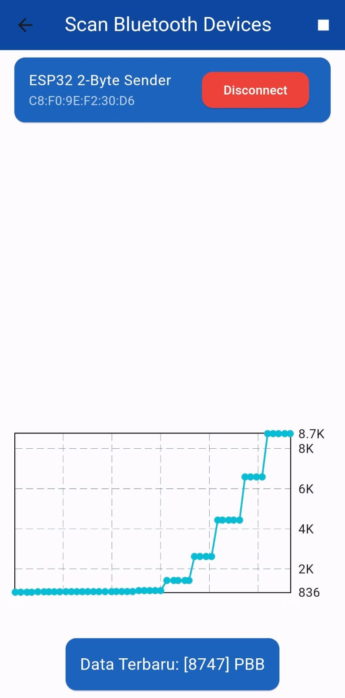
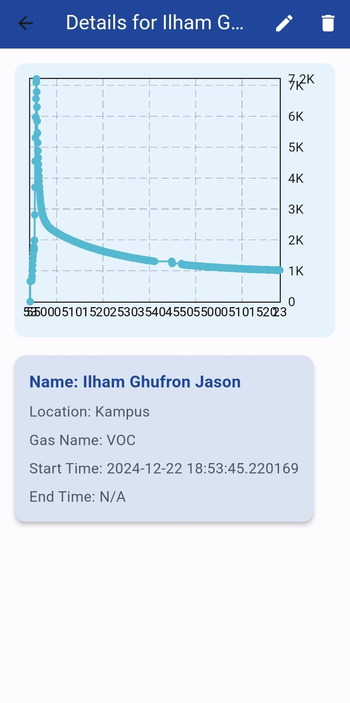
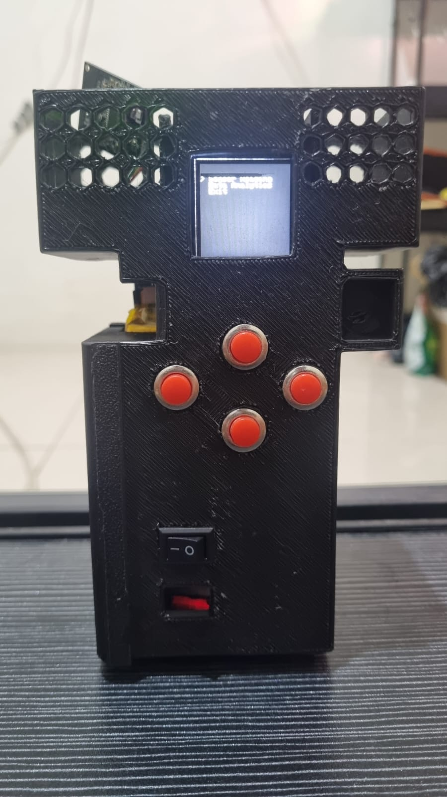

## Here are the results of my team's Capstone Design project

    
    
    

I was responsible for creating UI/UX and mobile applications through the Dart programming language with the flutter platform, and designing the flutter architecture so that it can send data to firebase via the internet, and receive data via Bluetooth from monitoring devices.
This project is used to monitor an ambient gas using a minimalist and easy-to-handle device. This tool can be monitored safely for approximately 16 hours in real-time through the tool and the internet with a mobile application. The database used is Firebase as its database and gets a delay of under 1 second for each data transmission.

